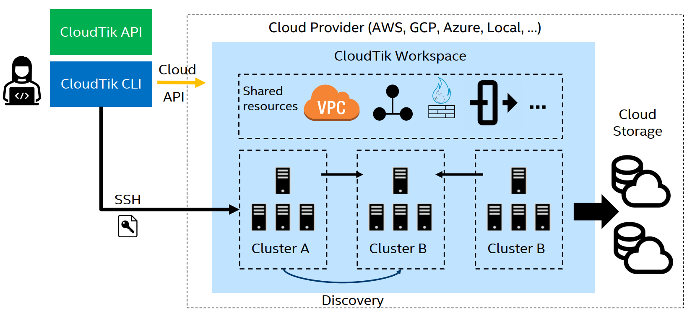
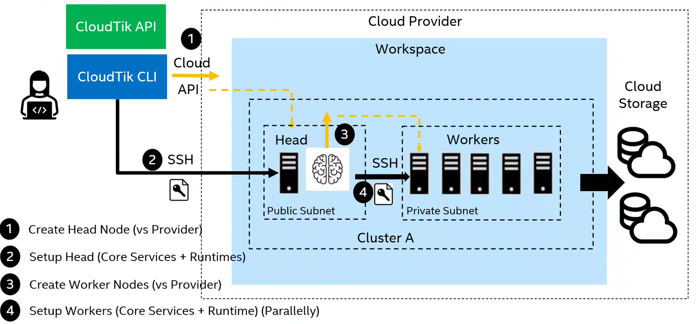
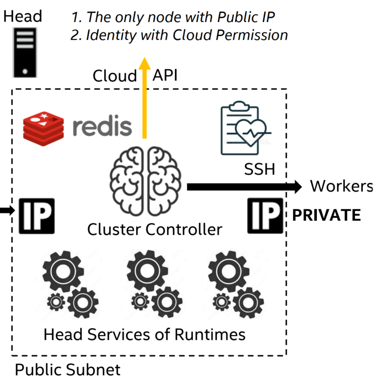
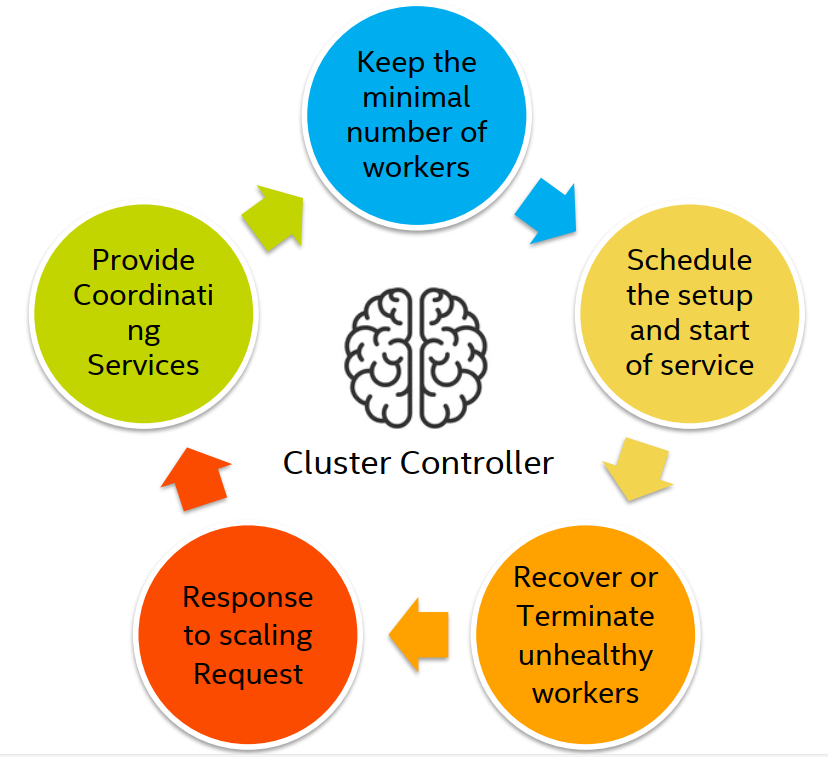
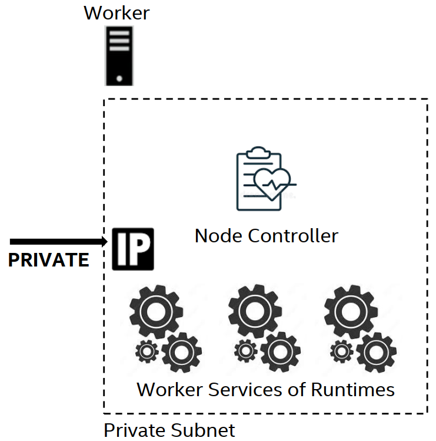
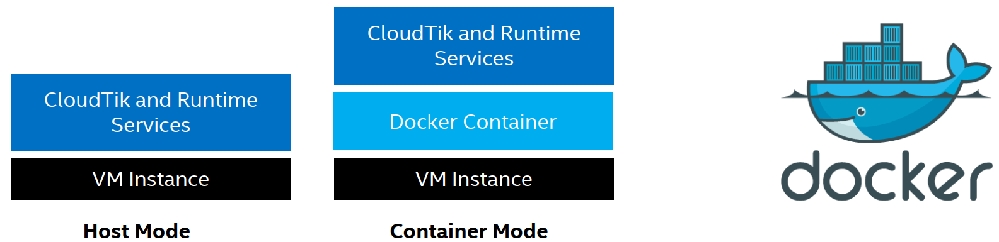
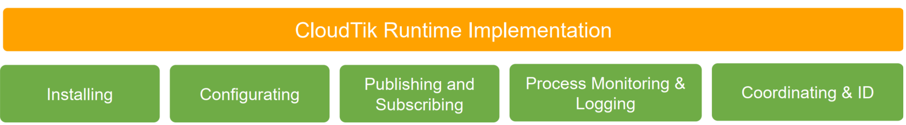

# Architecture Overview

## CloudTik Architecture

CloudTik: a cloud scaling platform for distributed analytics and AI integration.

- Built upon Cloud compute engines and Cloud storages 

- Support major public Cloud providers (AWS, Azure, GCP, and more to come) 

- Powerful and Optimized: Out of box and optimized runtimes for Analytics and AI 

- Simplified and Unified: Easy to use and unified operate experiences on all Clouds 

- Open and Flexible: Open architecture and user in full control, fully open-source and user transparent. 

**Workspace** makes it easy to manage shared Cloud resources such as your Cloud VPC, network, identity resources,
firewall or security groups. Users start to work with CloudTik by creating a workspace on the Cloud provider.

During the process of cluster creation, there are mainly 4 steps.

1. Create head node(Provider)
2. Set up head node(Core services + Runtimes)
3. Create worker nodes(Provider)
4. Set up workers(Core services + Runtimes)

### Head Node: the Brain of the cluster

Head node is the brain of the cluster, responsible for scaling (up & down) clusters.

**Core Services**

- *Cluster Controller*: Responsible for creating, setting up, or terminating worker instances.
- *Redis Shards*: Multiple Redis instances for serving shared cluster state.
- *Node Controller*: Heart beating and monitoring node and services health.

**Runtime Services**

- Head services of Runtimes (depending on what Runtimes are enabled)

### Worker Nodes

**Core Services**

- Node Controller: Heart beating and monitoring nodes and services health.

**Runtime Services**

- Worker services of Runtimes (depending on what Runtimes are enabled)

### Execution Mode

CloudTik supports to run services with two Execution Modes: 

- Host Mode: All the services will run on (VM) host. 

- Container Mode: All the service will run in Docker container on (VM) host. 
    - CloudTik handles all the docker stuff transparently (Installing, command execution  
        bridge). Users see little difference on operations. 
    

### Runtimes

**Runtime** is an abstraction and extension point to support various of *services* or *frameworks*.  

- Distributed: A distributed service in nature by design 

- Composable: User can choose what Runtimes to be installed, configured and run in a cluster.  

- Discoverable: A runtime can discover and utilize its dependent services running either within the cluster 
  or as another cluster in the same workspace. 

CloudTik provides powerful common infrastructure for Runtime to implement and deploy easily. 

