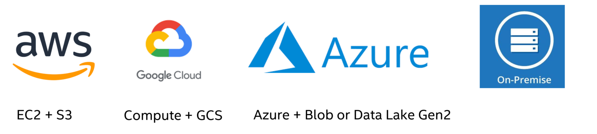
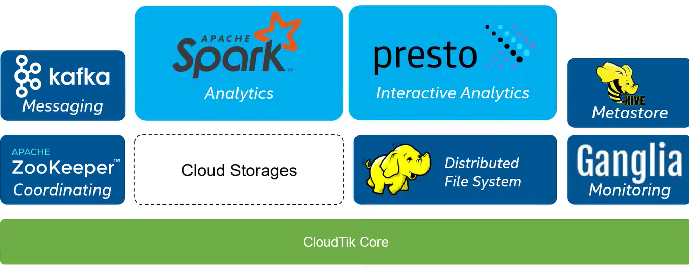

# Key Concepts

This section overviews CloudTik’s key concepts. 

- [Workspace](#workspace)
- [Cluster](#cluster)
- [Provider](#provider)
- [Runtime](#runtime)

## Workspace

**Workspace** provides the concept to make it easy for managing shared Cloud resources such as your Cloud VPC, network,
identity resources, firewall or security groups. Users start to work with Cloud by creating a Workspace on the Cloud provider.
CloudTik will help you create and configure: 

-  VPC shared by all the clusters of the workspace. 

-  A private subnet for workers and a Public Subnet for head node. 

-  Firewall rules for SSH access to head node and internal communication. 

-  A NAT gateway for Internet access. 

-  An identity for head node to Cloud API. 

## Cluster

Cloudtik helps users quickly create and manage analytics and AI clusters, 
which enables adding or removing compute, storage, and network services easily to meet the demands on prem and cloud providers.

## Provider

CloudTik supports node providers of your analytics and AI clusters both on prem and cloud such as AWS, Azure and GCP.

## Runtime

Runtime is an abstraction and extension point to support various of *services* or *frameworks*.  

- Distributed: A distributed service in nature by design 

- Composable: User can choose what Runtimes to be installed, configured and run in a cluster.  

- Discoverable: A runtime can discover and utilize its dependent services running either within the cluster 
  or as another cluster in the same workspace. 

CloudTik provides powerful common infrastructure for Runtime to implement and deploy easily. 

- **Spark**,  a multi-language engine for executing data engineering, data science, and machine learning.

- **HDFS**, a distributed file system designed to run on commodity hardware.

- **Ganglia**, a scalable distributed monitoring system for high-performance computing systems such as clusters and Grids.

- **Metastore**, a service that stores metadata related to Apache Hive and other services.

- **Presto**, a distributed SQL query engine for running interactive analytic queries against data sources of all sizes.

- **ZooKeeper**, a centralized service for maintaining configuration information, naming, providing distributed synchronization, and providing group services.

- **Kafka**, a community distributed event streaming platform capable of handling trillions of events a day.
